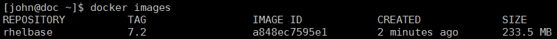

Hyperledger Fabric Build for RHEL on Linux on z Systems
=========================================================
This document describes the steps to build, configure and install the
infrastructure components associated with IBM’s Open Blockchain
technology, Hyperledger Fabric, on the Linux on z Systems platform.

More importantly, you will create the Docker artifacts using the base
RHEL 7.x system on which you will deploy. The base Docker image will be
RHEL 7.x based and have access to the same yum repositories as the
system on which you deploy. This eliminates the need to download any
pre-built Docker images from the public Docker repository, eliminating
one potential security exposure. The Docker images you create will be
kept in a repository that you create, thus remaining within your
control.

The major components include:
- [Golang programming language](#building-golang)
- [Docker client and daemon](#installing-the-docker-client--daemon)
- [Docker registry](#building-the-docker-registry)
- [Hyperledger Fabric](#build-the-hyperledger-fabric-core)
  - Peer
  - Membership and Security Services

Once all of the major components are in place on the bulid system, custom Docker
images are created for the Golang programming language, Hyperledger Fabric Peer,
and Hyperledger Fabric Membership and Security Services. This allows for
a fully *dockerized* development or proof-of-concept Hyperledger Fabric
environment.

The procedures in this guide are tailored for Red Hat Enterprise Edition
(RHEL) 7.x. Due to the ongoing development activity within the
Hyperledger project, there is a chance that portions of this document
may become obsolete or out of date.

For more information about the Hyperledger Fabric project, see
<https://github.com/hyperledger/fabric>.

> ***NOTE:***   
> The instructions contained in this document assume that you
> are using a non-root user with sudo authority and that the non-root
> user has been added to the **wheel** group. In addition, update the
> **/etc/sudoers** file to enable the **wheel** group with no password
> access, and append **/usr/local/bin** and the targeted directory that
> will contain the **go** executable, **/usr/local/go/bin**, to the
> **secure_path** variable.

Building Golang
===============
The Hyperledger Fabric and the Docker Registry are written using the
Golang programming language. Therefore, a Golang compiler needs to be
built in order to compile the Hyperledger Fabric and Docker Registry
source code.

Building Golang for Linux on z Systems is a two-step process:

1.  Cross-compile the Golang bootstrap tool on an x86-based
    machine running an up-to-date version of Linux.

2.  Build the Golang toolchain on Linux on z Systems using the bootstrap
    tool created in step 1.

For information on how the Golang bootstrapping process works, see the
blog entry at
<http://dave.cheney.net/2015/10/16/bootstrapping-go-1-5-on-non-intel-platforms>.

Cross-Compiling the Bootstrap Tool
----------------------------------
To build the Golang bootstrap tool you will need to use an
x86-based machine running an up-to-date version of Linux, e.g.,
RHEL 7.x.

> ***NOTE:*** If you do not have access to an x86-based Linux system, you can
> download the Golang Bootstrap tool from <https://drive.google.com/open?id=0B_zkrFk74VRuWGhPOURPaHUyYnc>.

1.  Install the dependencies:

    ```
    sudo yum install -y git wget tar gcc bzip2
    ```
2.  Create a directory for the amd64 version of the Golang toolchain:

    ```
    mkdir -p $HOME/go1.5.2
    cd $HOME/go1.5.2
    ```
3.  Download the amd64 Golang toolchain binary and extract it:

    ```
    wget https://storage.googleapis.com/golang/go1.5.2.linux-amd64.tar.gz
    tar -xvf go1.5.2.linux-amd64.tar.gz
    ```

4.  Clone the source code for the z Systems port of Golang:

    ```
    cd $HOME
    git clone https://github.com/linux-on-ibm-z/go.git
    ```
5.  Build the bootstrap tool:

    ```
    export GOROOT_BOOTSTRAP=$HOME/go1.5.2/go
    cd $HOME/go/src
    GOOS=linux GOARCH=s390x ./bootstrap.bash
    ```
The bootstrap tool is placed into a bzip tarball named
**go-linux-s390x-bootstrap.tbz** located in **$HOME** and
is used in the next step to compile the Golang programming language
source code on Linux on z Systems.

Building the Golang Toolchain
-----------------------------
To build the Golang toolchain you need to have successfully built the
Golang bootstrap tool outlined in the [Cross-Compiling the Bootstrap Tool](#cross-compiling-the-bootstrap-tool)
section of this document. After building the bootstrap tool, login to
your Linux on z Systems instance and perform the steps below.

1.  Install the dependencies.

    ```
    sudo yum install -y git gcc
    ```
2.  Transfer the bootstrap file to your Linux on z Systems instance and clone the Golang source:

    ```
    cd $HOME
    # scp or ftp $HOME/go-linux-s390x-bootstrap.tbz from the x86 system to $HOME on your Linux on z Systems instance
    tar -xf go-linux-s390x-bootstrap.tbz
    git clone https://github.com/linux-on-ibm-z/go.git
    cd $HOME/go
    git checkout release-branch.go1.6
    ```
3.  Build the Golang toolchain on Linux on z Systems and run all tests.

    ```
    export GOROOT_BOOTSTRAP=$HOME/go-linux-s390x-bootstrap
    cd $HOME/go/src
    ./all.bash
    ```

4. Copy the Golang directory to the final install directory,
**/usr/local**, and permanently update your **PATH**
environment variable to use the new toolchain.  The **go** directory is typically located under **/usr/local**.

    ```
    sudo cp -ra $HOME/go /usr/local
    # Also add the following lines to ~/.bash_profile
    export PATH=/usr/local/go/bin:$PATH
    ```

5. Cleanup and delete bootstrap files:

    ```
    cd $HOME
    rm -rf go-linux-s390x-bootstrap*
    ```

Docker
======
The Hyperledger Fabric peer relies on Docker to deploy and run Chaincode
(aka Smart Contracts). In addition, for development purposes, the
Hyperledger Fabric peer service and the membership and security service
can both run in Docker containers. Instructions for building both a peer
service Docker image and a membership and security service Docker image
are covered later in this document.

Installing the Docker Client / Daemon
-------------------------------------

1.  Install prerequisite package for Docker:

    ```
    sudo yum -y install device-mapper
    ```

2.  Download the Docker binary tarball and untar the file:

    ```
    cd $HOME
    wget ftp://ftp.unicamp.br/pub/linuxpatch/s390x/redhat/rhel7.2/docker-1.10.1-rhel7.2-20160408.tar.gz
    tar -xf docker-1.10.1-rhel7.2-20160408.tar.gz
    ```

3.  Copy the Docker binary file to a directory that is contained within the
    current **PATH** environment variable:

    ```
    sudo cp docker-1.10.1-rhel7.2-20160408/docker /usr/bin
    ```

4.  Create a Docker configuration file:

    ```
    sudo mkdir -p /etc/docker
    sudo touch /etc/docker/docker.conf
    sudo chmod 664 /etc/docker/docker.conf
    ```
5.  Edit the Docker configuration file created in the previous step and add the following line and save:

    ```
    DOCKER_OPTS="-H tcp://0.0.0.0:2375 -H unix:///var/run/docker.sock --insecure-registry localhost:5050"
    ```

6.  Create a Service for Docker:

    a) Setup initial service file:

    ```
    sudo touch /etc/systemd/system/docker.service
    sudo chmod 664 /etc/systemd/system/docker.service
    ```

    b) Copy and paste the following contents into **/etc/systemd/system/docker.service** :

    ```
    [Unit]
    Description=Docker Application Container Engine
    Documentation=https://docs.docker.com

    [Service]
    Type=notify
    ExecStart=/usr/bin/docker daemon $DOCKER_OPTS
    EnvironmentFile=-/etc/docker/docker.conf

    [Install]
    WantedBy=default.target
    ```

7.  Start the Docker service and cleanup work directory:

    ```
    sudo systemctl daemon-reload
    sudo systemctl start docker.service
    rm -rf $HOME/docker-1.10.1-rhel7.2-20160408*
    ```

    > ***NOTE:*** In order to issue Docker commands from a
    > non-root user without prefixing the command with sudo, a docker group
    > needs to be created and the non-root user needs to be added to the
    > docker group:  
    > **sudo groupadd docker**  
    > **sudo usermod -a -G docker \<non-root-user\>**  
    >
    > The \<non-root-user\> may have to logout and then login to pick up the change.
    > If you didn't update your **.bash_profile** file when installing Golang,
    > you'll have to update your PATH environment variable:  
    > **export PATH=$PATH:/usr/local/go/bin**

Building the Docker Registry
----------------------------
The Docker Registry 2.0 implementation for storing and distributing
Docker images is part of the GitHub Docker Distribution project. The
Docker Distribution project consists of a toolset to pack, ship, store,
and deliver Docker content.

A local Docker registry can be used for the Hyperledger Fabric environment
if you are not going to access public Docker images.

1.  Install the dependencies:
    ```
    sudo yum install -y git make
    ```
    > ***NOTE:*** Golang is required to build the Docker Registry. See [Building Golang](#building-golang)
    > to build the Golang toolchain. You may have already
    > installed the **git** and **make** packages when building Golang. If
    > so, ignore the installation of the packages within this step.

2.  Create a distribution directory and clone the source code:

    ```
    mkdir -p $HOME/git/src/github.com/docker
    cd $HOME/git/src/github.com/docker
    git clone https://github.com/docker/distribution.git
    cd $HOME/git/src/github.com/docker/distribution
    git checkout v2.3.0
    ```
3.  Set **GOPATH** and **DISTRIBUTION_DIR** environment variables:

    ```
    export DISTRIBUTION_DIR=$HOME/git/src/github.com/docker/distribution
    export GOPATH=$HOME/git
    export GOPATH=$DISTRIBUTION_DIR/Godeps/_workspace:$GOPATH
    ```
4. Build the distribution binaries:

    ```
    cd $HOME/git/src/github.com/docker/distribution
    make PREFIX=$HOME clean binaries
    sudo cp $HOME/bin/registry /usr/bin
    ```
5.  Run the Test Suite:

    ```
    make PREFIX=$HOME test
    ```

6.  Tailor the Docker Registry configuration file:

    ```
    sudo cp $DISTRIBUTION_DIR/cmd/registry/config-dev.yml /etc/docker/registry-config.yml
    sudo sed -i "s/redis/inmemory/" /etc/docker/registry-config.yml
    sudo sed -i "s/5000/5050/" /etc/docker/registry-config.yml
    ```

7.  Create the default directory to store images, if it does not exist:

    ```
    sudo mkdir -p /var/lib/registry
    ```

8. Create a Service for the Docker Registry

    a) Setup initial service file:

    ```
    sudo touch /etc/systemd/system/docker-registry.service
    sudo chmod 664 /etc/systemd/system/docker-registry.service
    ```

    b) Copy and paste the following contents into **/etc/systemd/system/docker-registry.service** :

    ```
    [Unit]
    Description=Docker Application Container Engine
    Documentation=https://github.com/docker/distribution

    [Service]
    Type=simple
    ExecStart=/usr/bin/registry /etc/docker/registry-config.yml

    [Install]
    WantedBy=default.target
    ```
    >***NOTE:*** Be sure that all lines begin in column 1 when you paste in the above contents.

9.  Start the Docker Registry service:

    ```
    sudo systemctl daemon-reload
    sudo systemctl start docker-registry.service
    ```

For more information on the Docker Distribution project, see
<https://github.com/docker/distribution>.

Build and Install RocksDB
=========================
RocksDB is an embeddable persistent key-value store for fast storage and
is used by the Hyperledger Fabric peer, membership and security service
components.

1.  RocksDB is written using the C++ programming language. Make sure
    that the C++ compiler is installed along with the following compression packages:

    ```
    sudo yum -y install gcc-c++ zlib-devel snappy-devel bzip2-devel
    ```
2.  Download and build RocksDB:

    ```
    cd $HOME
    mkdir -p git/rocksdb && cd git
    git clone --branch v4.1 --single-branch --depth 1 https://github.com/facebook/rocksdb.git
    cd rocksdb
    sed -i -e "s/-march=native/-march=zEC12/" build_tools/build_detect_platform
    sed -i -e "s/-momit-leaf-frame-pointer/-DDUMMY/" Makefile
    make shared_lib && sudo INSTALL_PATH=/usr make install-shared && sudo ldconfig
    ```
    >***NOTE:*** Change the value of **-march** to the z Systems model type, e.g., **z196**,
    > if your Linux system is not running on a z Systems EC12.

Build a Docker Image for Hyperledger Fabric Use
===============================================
The section describes the steps required to build a Docker image that is
comprised of the Golang programming language toolchain and RocksDB built upon the
RHEL operating system. There is no need to download any pre-existing
Docker images from the Docker Hub or from any other Docker registry that
is on the internet.

It is a two-step process to build the Docker image:

1.  Build your own RHEL Docker image from scratch.

2.  Build a Golang toolchain Docker image, which includes RocksDB, from the
    base RHEL Docker image built in step 1.

This Docker image is used by the Hyperledger Fabric peer component when
deploying Chaincode. The peer communicates with the Docker Daemon to
initially create docker images based on the Golang toolchain Docker
image and contains the compiled Chaincode built from source specified by
the **peer chaincode deploy** command. Docker containers are started by the peer
and execute the Chaincode binary awaiting further Blockchain
transactions, e.g., invoke or query.

Build a Base RHEL Docker Image
------------------------------

1.  Make sure that your Docker Daemon and Docker Registry are started.
    Refer to [Installing the Docker Client / Daemon](#installing-the-docker-client--daemon) and [Building the Docker Registry](#building-the-docker-registry) sections above for building and starting the Docker Daemon and Docker Registry.

2.  Copy and paste the contents of
    <https://github.com/docker/docker/blob/master/contrib/mkimage-yum.sh>
    into a new file, **mkimage-yum.sh**, file on your local RHEL system where the Docker image
    will be created. Place the script into **/usr/local/bin**. Ensure
    the new script file has the executable attribute set.

3.  If you are not using the Red Hat subscription service to update
    packages on your system, add the following lines to your
    **mkimage-yum.sh** script just before the **yum -c "$yum_config"
    --installroot="$target" -y clean** command:

    ```
    cp -ra /etc/yum/* "$target"/etc/yum/
    cp -ra /etc/yum.repos.d "$target"/etc
    yum -c "$yum_config" --installroot="$target" -y install net-tools
    ```
    > ***NOTE:*** This command will copy all of your existing yum repository definitions
    > during the build of the RHEL Docker image. Additional build steps
    > access the repositories to install prerequisite packages during the
    > building of additional Docker images used within the Hyperledger
    > Fabric environment.

4.  Execute the **mkimage-yum.sh** script to create and import the RHEL
    Docker image:

    ```
    sudo mkimage-yum.sh rhelbase
    ```
5.  Obtain the **rhelbase** Docker image’s **TAG**.
    The **rhelbase:\<TAG\>** is required to build the Golang
    toolchain Docker image:

    ```
    docker images
    ```
    > Look for **rhelbase** in the REPOSITORY column and note the TAG name
    > for **rhelbase**.
    >
    > In the example below the TAG is 7.2.
    >
    > 
    >
    > ***NOTE:*** Optionally, you can place this base image into your Docker
    > registry’s repository by issuing the commands:
    >  
    > *docker tag rhelbase:\<TAG\> \<docker_registry_host_ip\>:5050/rhelbase:\<TAG\>   
    > docker push \<docker_registry_host_ip\>:5050/rhelbase:\<TAG\>*

Build a Golang and RocksDB Docker Image from the Base RHEL Docker Image
---------------------------------------------------------------------
Once the base RHEL Docker image is created, complete the following steps
to build a Golang toolchain Docker image:

1.  Make sure that the Docker Daemon and Docker Registry have
    been started. Refer to [Installing the Docker Client / Daemon](#installing-the-docker-client--daemon) and
    [Building the Docker Registry](#building-the-docker-registry) sections above
    for building and starting the Docker Daemon and Docker Registry.

2.  Create a Dockerfile:

    ```
    cd $HOME
    mkdir dockerbuild
    mv git/rocksdb dockerbuild
    mv go dockerbuild
    cd dockerbuild
    vi Dockerfile
    ```

3. Cut and paste the following lines into your Dockerfile and then save
the file:

    ```
    FROM rhelbase:<TAG>
    RUN yum -y groupinstall "Development Tools"
    RUN yum -y install zlib-devel snappy-devel bzip2-devel
    COPY go /usr/local/go
    COPY rocksdb /tmp/rocksdb
    WORKDIR /tmp/rocksdb
    RUN INSTALL_PATH=/usr make install-shared && ldconfig && rm -rf /tmp/rocksdb
    ENV GOPATH=/opt/gopath
    ENV GOROOT=/usr/local/go
    ENV PATH=$GOPATH/bin:/usr/local/go/bin:$PATH
    WORKDIR $GOPATH
    ```
    > ***NOTE:*** Replace **\<TAG\>** with the TAG value obtained above in
    > step 5 of [Build a Base RHEL Docker Image](#build-a-base-rhel-docker-image).

4.  Issue the **docker build** command:

    ```
    docker build -t hyperledger/fabric-baseimage -f Dockerfile .
    ```

5.  Confirm that your new image was created by issuing the **docker
    images** command.

6.  **Optional:** Push your new Golang toolchain and RocksDB Docker image
    to your Docker Registry:
    ```
    docker tag hyperledger/fabric-baseimage <docker_registry_host_ip>:5050/hyperledger/fabric-baseimage
    docker push <docker_registry_host_ip>:5050/hyperledger/fabric-baseimage
    ```
    > ***NOTE:*** Replace **<docker_registry_host_ip>** with the IP
    > address of the host that is running your Docker Registry.


Build the Hyperledger Fabric Core
=================================
The Hyperledger Fabric Core contains code for running validating peers and membership services for enrollment and certificate authority tasks.

1.  Download the Hyperledger Fabric code into a writeable directory:

    ```
    cd $HOME
    mkdir -p fabricwork/src/github.com/hyperledger
    cd fabricwork/src/github.com/hyperledger
    git clone https://github.com/hyperledger/fabric.git
    ```
2.  Setup environment variables prior to building the Hyperledger Fabric components:

    ```
    export GOROOT=/usr/local/go
    export GOPATH=$HOME/fabricwork
    ```
    > ***NOTE:*** Also add the the GOPATH environment variable to root's
    > **.bash_profile** file if you run the Hyperledger Fabric peer or
    > membersrvc executables natively.

3.  Build the Hyperledger Fabric executable binaries. The peer binary
    runs validating peer nodes and the membersrvc binary is the membership
    and security server that handles enrollment and certificate requests.
    In addition to the peer and membersrvc executables, supporting Docker images
    are created for development use. The **Makefile** is altered to allow for the
    use of your own **hyperledger/fabric-baseimage** Docker image:

    ```
    sed -i "/docker\.sh/d" $GOPATH/src/github.com/hyperledger/fabric/Makefile
    cd $GOPATH/src/github.com/hyperledger/fabric
    make peer membersrvc
    ```
    >***NOTE:*** The peer and membersrvc executables are placed into the **$GOPATH/src/github.com/hyperledger/fabric/build/bin** directory

***Optional:*** If you are planning to run the Fabric executables locally and
not inside docker containainers, you can create shell scripts to start the
peer and the membership and security services executables in the background
and re-direct logging output to a file.

1.  Create a file called **fabric-peer.sh** located in
    **/usr/local/bin** with the executable attribute set:

    ```bash
    #!/bin/bash
    export GOPATH=<parent-directory>
    cd $GOPATH/src/github.com/hyperledger/fabric/build/bin
    ./peer node start --logging-level=debug > /var/log/fabric-peer.log 2>&1 &
    ```
    > **NOTE:** Change **\<parent-directory\>** to the root directory of where
    the Hyperledger Fabric code is located (up to, but not including the **src** directory).

2.  Create a file called **membersrvc.sh** located in **/usr/local/bin**
    with the executable attribute set:

    ```bash
    #!/bin/bash
    export GOPATH=<parent-directory>
    cd $GOPATH/src/github.com/hyperledger/fabric/build/bin
    ./membersrvc > /var/log/membersrvc.log 2>&1 &
    ```
    > **NOTE:** Change **\<parent-directory\>** to the root directory of where
    the Hyperledger Fabric code is located (up to, but not including the **src** directory).

Build Hyperledger Fabric Docker Images
--------------------------------------
If you have progressed through this document from the beginning, you
already built the components necessary to run the Hyperledger Fabric
peer along with the Hyperledger Fabric membership services and security
server on your Linux system.

However, if you would like to run your peer(s) or membership services
components in their own Docker containers, perform the following steps
to build their respective Docker images.

```
cd $GOPATH/src/github.com/hyperledger/fabric
make peer-image membersrvc-image
```

Unit Tests
==========
If you feel inclined to run the Hyperledger Fabric unit tests, follow
the steps below:

```
sudo rm -rf /var/hyperledger
cd $GOPATH/src/github.com/hyperledger/fabric
sudo GOROOT=/usr/local/go GOPATH=<parent-directory> PATH=$PATH:/usr/local/go/bin make unit-test
```

> **NOTE:** Change **\<parent-directory\>** to the root directory of where
the Hyperledger Fabric code is located (up to, but not including the **src** directory).

Behave Tests
============
A thorough suite of Behave tests are included with the Hyperledger Fabric code base.  These Behavior-driven development test cases are written in a natural language and backed up by python scripts.  The behave tests take advantage of the Docker Compose tool to setup multi-peer Hyperledger Fabric Docker containers and run scenarios that exercise security, consensus, and chaincode execution, to name a few.

1. Install prerequisites for Behave:

    ```
    cd $HOME
    sudo yum -y install python-setuptools
    curl "https://bootstrap.pypa.io/get-pip.py" -o "get-pip.py"
    sudo python get-pip.py
    sudo pip install --upgrade pip
    sudo pip install behave nose docker-compose
    sudo pip install -I flask==0.10.1 python-dateutil==2.2 pytz==2014.3 pyyaml==3.10 couchdb==1.0 flask-cors==2.0.1 requests==2.4.3
    ```
2. Add a firewall rule to ensure traffic flow on the docker0 interface with a  destination port of 2375 (docker daemon API port).  The Behave tests take advantage of Docker containers to test the Fabric peer's functionality.

    ```
    sudo iptables -I INPUT 1 -i docker0 -p tcp --dport 2375 -j ACCEPT
    ```

3.  Shutdown any peer instances prior to running the Behave tests:

    ```
    sudo killall peer
    ```

4. Run the Behave tests:

    ```
    cd $HOME/fabricwork/src/github.com/hyperledger/fabric
    make behave
    ```
